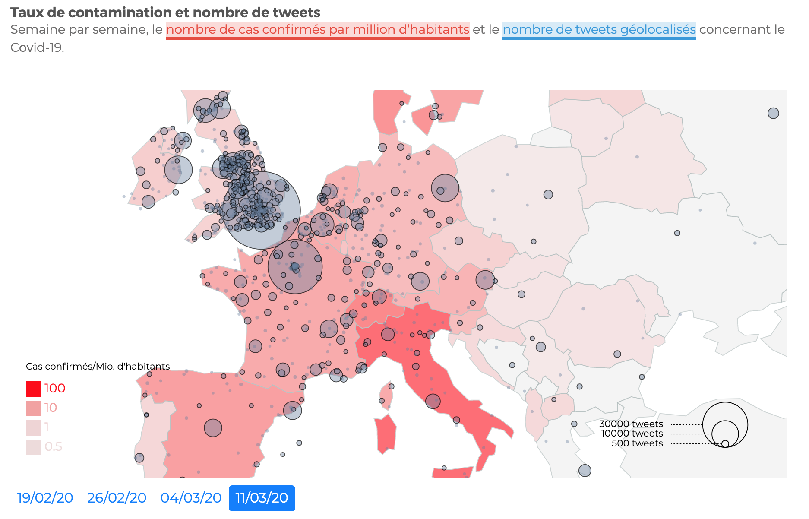
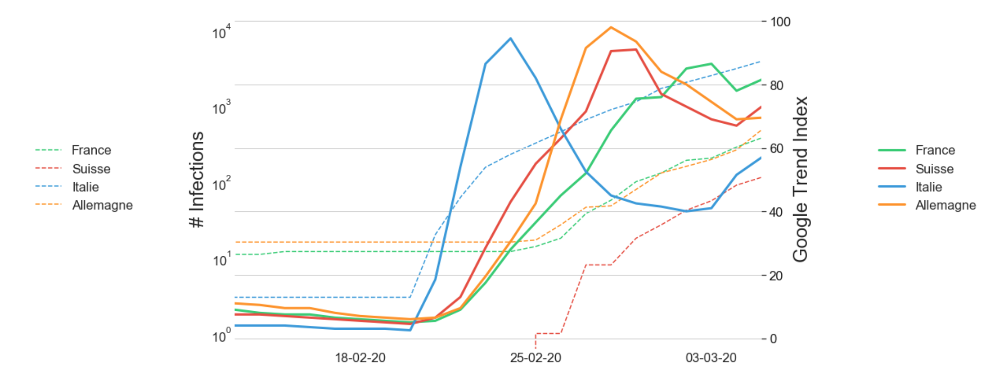
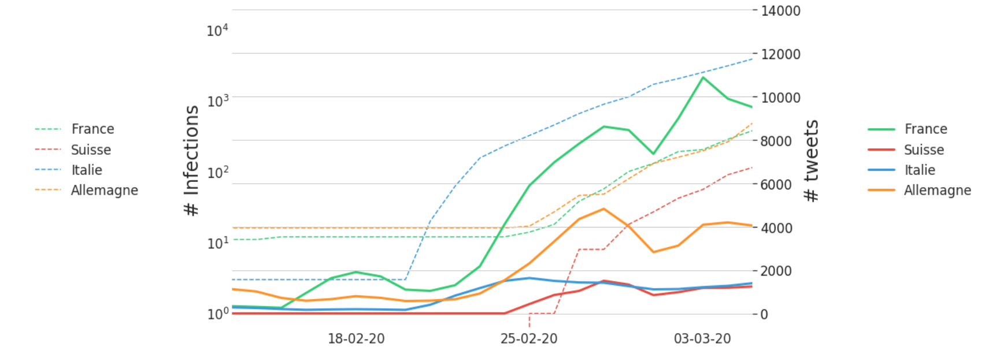
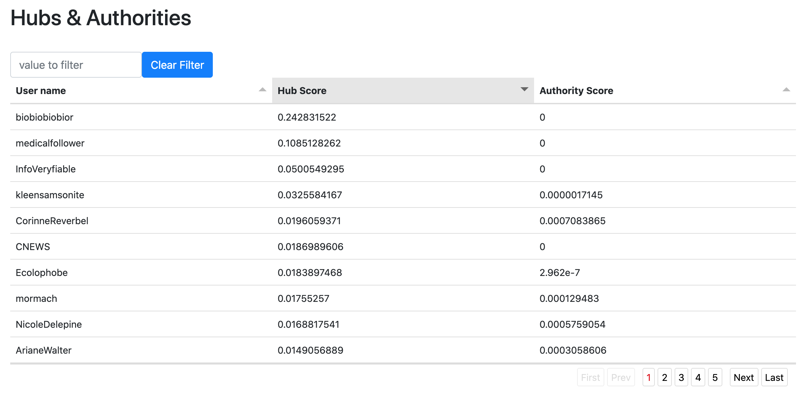

# Semester Project: Overview of Covid-19's infodemic 

In this research project, started at the same time as the coronavirus crisis, we are interested in the different impacts of the pandemic on the internet's flow of information. Whether in the medias or on social networks, covid-19 has generated an astronomical amount of information exchange in the world, the analysis of these data could allow us to better understand the reaction of some actors in this infodemic.

This project was carried out in collaboration with the newspaper "letemps.ch" with the aim of writing a series of articles on this infodemia.

## Problematic
As the pandemic spreads around the world and population containment accelerates, social networks and search engines provide a window for people to learn and share about the virus. Mediatization of the pandemic shapes population's reaction to the virus, providing a support to rapidly share good practices about virus prevention but also a support for fake news spreading which could increase population anxiety. In this project we will mainly focus on two subjects, quantifying the information flows about covid-19 and designing a tool to track and vizualise the communities on twitter.

## Covid-19 infodemic

### Google Trend
As our objective is to study the association between the spread of the pandemic and the flow of information on internet, we first looked into the google search index provided by GTrend for the search term "coranavirus". Using the python library `pytrends` we were able to compare the indexes of several european countries together with the number of confirmed cases of Covid-19. 

#### Google search index versus COVID-19 cases

For Italy, the google search spike coincides perfectly with the outbreak of COVID-19 cases in the country. It is also interesting to note that the countries surrounding Italy are seeing an increase in the number of searches a few days after Italy, which seem to be related to the spread of the virus in Italy and not only in their respective countries.

### Twitter
We then took an interest in what was happening on Twitter. After mining more than 10 million tweets, several analysis was conducted (see [this notebook](notebooks/COVID.ipynb)), not finding anything conclusive in the lexical analysis of tweets, in the same line as for the Google index, we were interested in the number of tweets posted on the coronavirus in different European countries. 

#### Number of tweets versus COVID-19 cases

Even if globally the graph has a similar trend to the one with the google index, we can see here that the answer depending on the country is very different, for example Italy seems too tweet about "coronavirus" much less than France. These results are still to be taken with tweezers, most of the tweets collected are not geolocated.  

### News Medias
After studying the global volume of tweets about the coronavirus, we were interested in the media's reaction to this crisis. Several approaches were conducted, we started by scrapping all online articles from some known Swiss newspapers such as `nzz`, `lesobservateurs.ch`, `le temps.ch`... This approach allowed us to make a first analysis of the lexical fields and keywords used (see [this notebook](notebooks/lesobservateurs.ipynb)), the idea was to see if some newspapers were using the coronavirus as a pretext to convey another message or to compare the choice of lexical fields between different newspapers to talk about the same subject. This approach was not very revealing but it also allowed us to compare the ratio of articles mentioning the coronavirus between the different journals ([see this image](figures/covid_proportions.pdf)).
The second approach was to simply compare media reactions on twitter only, the same style of analysis was conducted.

The results of this study resulted in an newspaper [article](https://labs.letemps.ch/interactive/2020/covid-trends/) in which the premises of this study are summarized.

This first part was also completed by a spatial approach in the Data Visualization course, where the goal was to relate COVID-19's spatial distribution with population reaction, defined here by the amount of information on both social networks (i.e. Twitter) and search engines (i.e. Google Trend). You can see the result on [this web app](https://com-480-data-visualization.github.io/com-480-project-coronateam/).

## Twitter interactions and Covid-19 conspirators

In the second part of this project we aimed to take a look into some communities of conspirators that use the covid-19 pandemic to expand themself and spread their messages.
In this spirit we started to developp a tool to track interactions between people on twitter. The implementation of the tool is not done yet but you can take a look on what we achieved so far [here](https://fanfou02.github.io/twitter-interactions-graph/) and see the code on [this repo](https://github.com/Fanfou02/twitter-interactions-graph).

### How it's work
The principle is simple, from a keyword or a hashtag, we retrieve all tweets corresponding to this keyword on twitter. With this tweet list, we can then build an interaction graph and apply some well known algorithms to retrieve important users/tweet and better understand the communities that use this keyword.

### Interactions 
All users are represented by a node and when an interaction happens between two nodes we add an edge or update the weight of an existing edge. But what is an interaction ? We define them as follow: 
- an user mention another user
- an user retweet another user
- an user reply to another user
In some cases, we might consider only the retweets to focus on the actors who have a more important role in disseminating information.

### Identifying important users & tweets
Building an interaction graph allows us to play with some of the algorithms of graph theory in order to get an insight into our communities.
If we consider our nodes as web pages from which users can retrieve information, we can apply some well-known algorithms to measure the importance of the node, in our case hits and PageRank. These algorithms fit perfectly with our representation of interactions on Twitter and allow us to retrieve the actors who propagate the most information about the chosen keyword in the Twitter community. An example with the keyword "chloroquine" is presented below (only French tweets):

### Node sampling

Depending on our chosen keyword, the resulting number of tweets can be enormous, in order to better represent the information and retains 

### Community detection

## Workspace 
- `scripts` : scripts used to mine all the data needed in this project 
- `notebooks` : jupyter notebooks used to process and vizualize the data mined
- `data`: contains a small amount of seeds lists used to filter our data mining tools, the datasets mined are stored on a external disk
- `figures`: some of the vizualisations produced in this project

## Credits

> Author: François Quellec

> Professor: Karl Aberer

> Doctorant: Jérémie Rappaz 